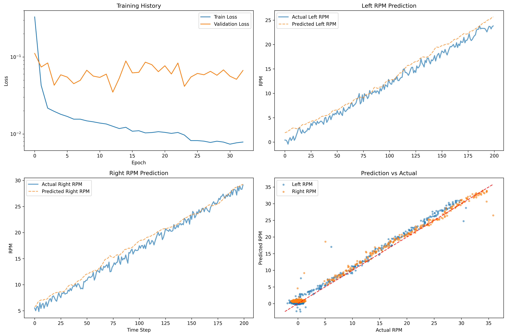

## Using long short time memory for state estimation in small motors

### Proof-of-concept

This is just proof of concept of a model that will estimate a motors output for a given input, using LSTM. 

The model will generate a sequence of commands for the motor to reach a determined speed.  

### Results

### Requirements

- torch
- pandas
- numpy
- scikit-learn

Can Altineller <can@acada.dev>
